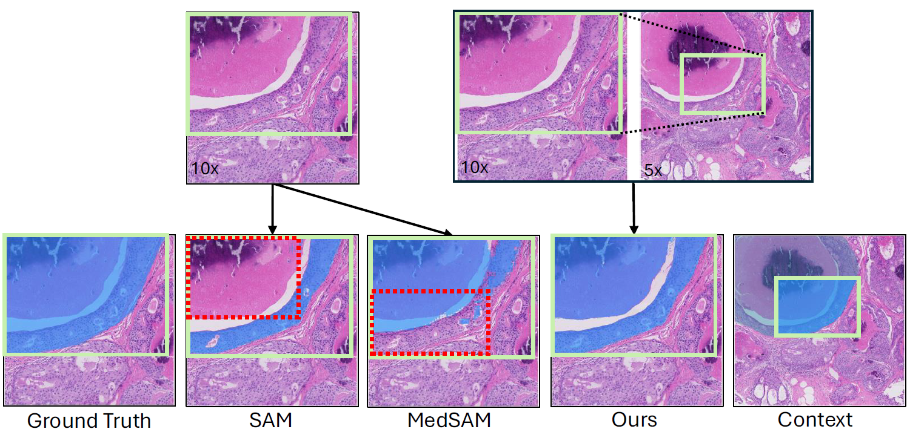
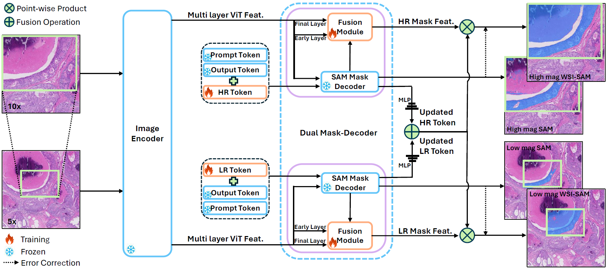
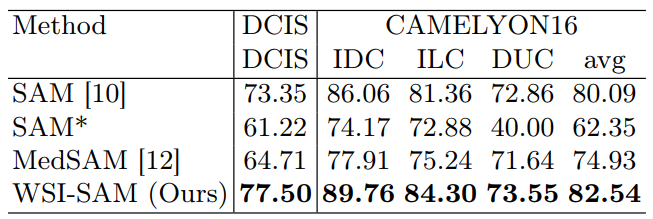
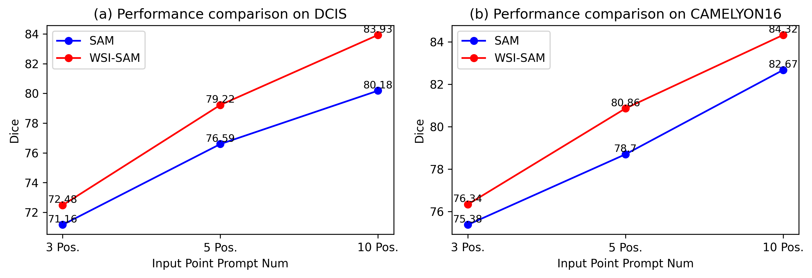

<<<<<<< HEAD
<<<<<<< HEAD
=======
>>>>>>> 6680bfd787b6bd02c3d671c656b5b844624af575
# WSI-SAM: Multi-resolution Segment Anything Model (SAM) for histopathology whole-slide images

> [WSI-SAM](https://arxiv.org/pdf/2403.09257) has been accepted at MICCAI 2024 COMPAYL Workshop! :tada::tada::tada:

## Motivation
<p align="center">
  
</p>

## Introduction
The Segment Anything Model (SAM) marks a significant advancement in segmentation models, offering robust zero-shot abilities and dynamic prompting. 
However, existing medical SAMs are not suitable for the multi-scale nature of whole-slide images (WSIs), restricting their
effectiveness. To resolve this drawback, we present WSI-SAM, enhancing SAM with precise object segmentation capabilities for histopathology images using multi-resolution patches, 
while preserving its efficient, prompt-driven design, and zero-shot abilities. 
To fully exploit pretrained knowledge while minimizing training overhead, we keep SAM frozen, introducing only minimal extra parameters and computational overhead.
In particular, we introduce High-Resolution (HR) token, Low-Resolution
(LR) token and dual mask decoder. This decoder integrates the original
SAM mask decoder with a lightweight fusion module that integrates features at multiple scales. Instead of predicting a mask independently, we
integrate HR and LR token at intermediate layer to jointly learn features
of the same object across multiple resolutions. Experiments show that
our WSI-SAM outperforms state-of-the-art SAM and its variants. In particular, our model outperforms SAM by 4.1 and 2.5 percent points on a
ductal carcinoma in situ (DCIS) segmentation tasks and breast cancer
metastasis segmentation task (CAMELYON16 dataset).
<p align="center">
  
</p>

## Results
### Box
<p align="center">
  
</p>

### Point
<p align="center">
  
</p>

## Installation
The code requires python>=3.8, as well as pytorch>=1.7 and torchvision>=0.8. Please follow the instructions [here](https://pytorch.org/get-started/locally/) to install both PyTorch and TorchVision dependencies. Installing both PyTorch and TorchVision with CUDA support is strongly recommended.

### Example conda environment setup
```
conda create --name wsi_sam python=3.8 -y
conda activate wsi_sam

# under your working directory
git clone https://github.com/HongLiuuuuu/WSI-SAM.git
cd WSI-SAM
pip install -e .
```
## Model Checkpoints
Now we only support `vit_tiny` based models, please download the model checkpoints [here](https://drive.google.com/drive/u/0/folders/1wSX79zI0suasgREeeLxC4h_aBjlxyA3E) and put them into the pretrained_checkpoint folder:
```
mkdir pretrained_checkpoint
```
## Getting Started
Now we provide a inference example with `examples/high.png` and `examples/low.png` as the inputs.
```
python inference.py
```
## Citation
If you find WSI-SAM useful in your research or refer to the provided baseline results, please star ⭐ this repository and consider citing 📝:
```
@inproceedings{wsisam,
      title={WSI-SAM: Multi-resolution Segment Anything Model (SAM) for histopathology whole-slide images}, 
      author={Hong Liu and Haosen Yang and Paul J. van Diest and Josien P. W. Pluim and Mitko Veta},
      year={2024},
      eprint={2403.09257},
      url={https://arxiv.org/abs/2403.09257}, 
}
```
<<<<<<< HEAD
=======

>>>>>>> c7b0e12ba0d21d643236562199d66c91af4ce208
=======
>>>>>>> 6680bfd787b6bd02c3d671c656b5b844624af575
